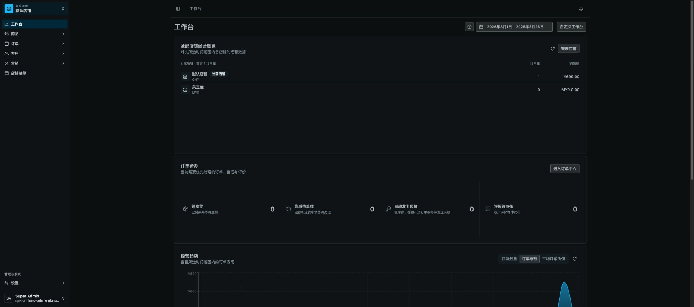
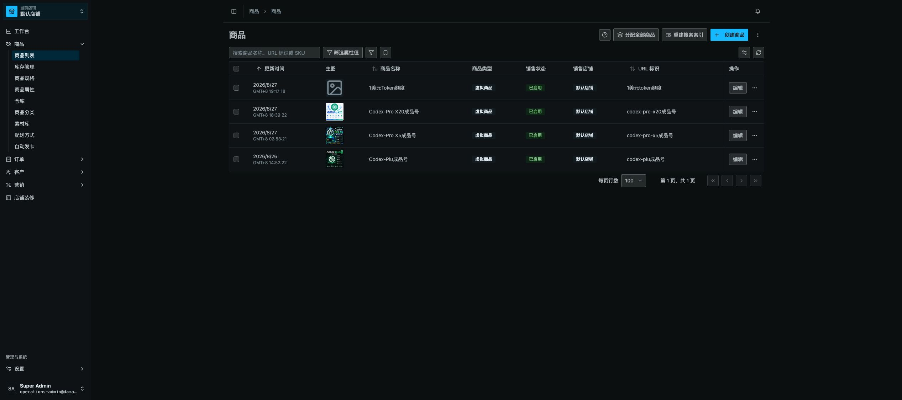
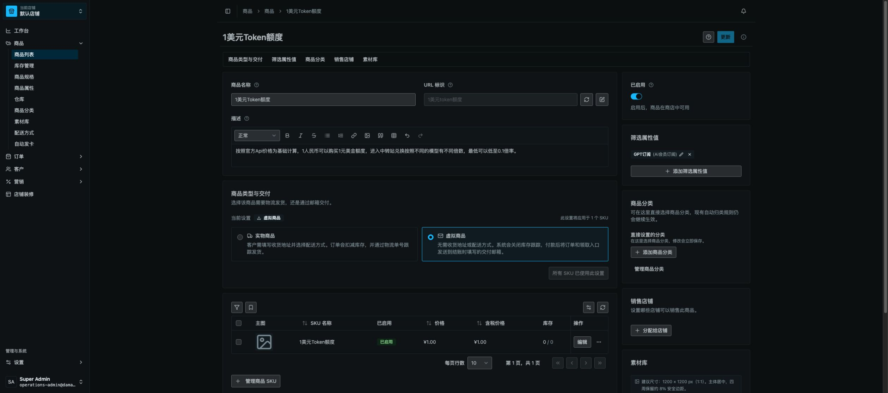
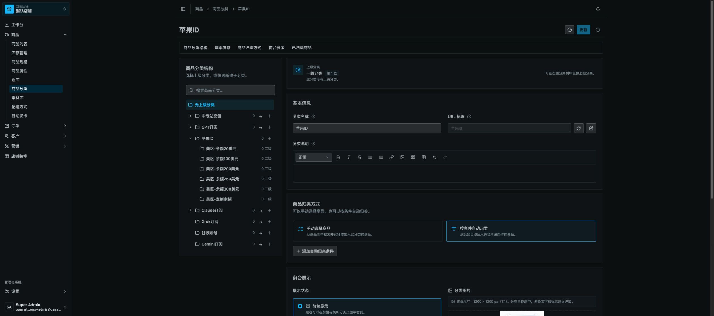
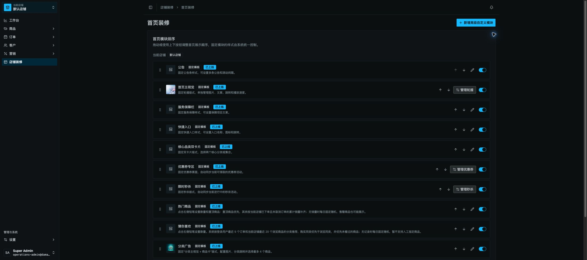
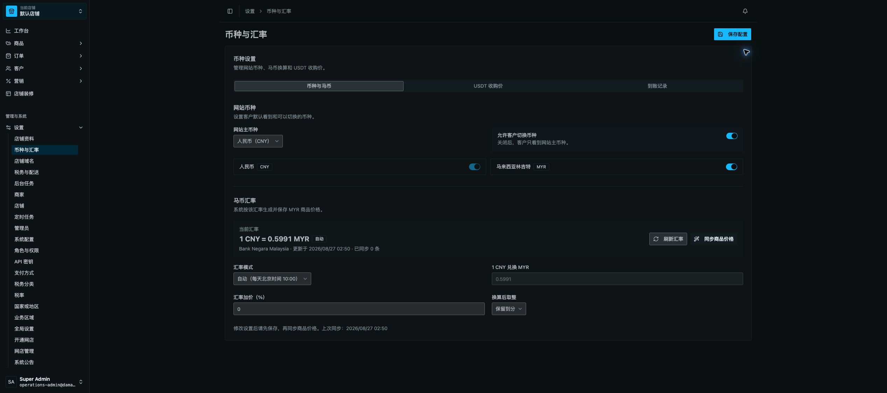
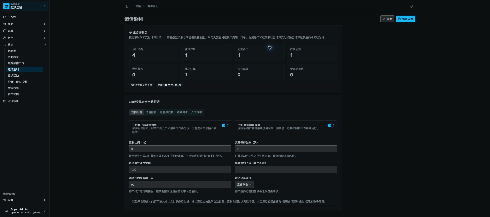

# Vendure 管理后台全面审计报告

审计时间：2026-08-27（America/Los_Angeles）  
审计对象：生产后台 `https://console.damatong.net/dashboard/` + 当前工作区源码  
项目路径：`/Users/wangchao/Desktop/源码文件夹/vendure开源/vendure-master`  
技术栈：TypeScript、React 19、TanStack Router/Query、NestJS、GraphQL、TypeORM、Vendure monorepo  
包管理器：Bun（`bun.lock`）  
分支：`release/workspace-consolidation-20260826`，相对 `origin/main` 落后 12 个提交

> 重要边界：当前工作区有大量未提交修改，生产后台的文案和当前源码已有差异。本报告把“生产实机表现”和“当前工作区代码风险”分开核对，不能把尚未发布的源码改动当成生产已生效。审计期间没有提交、推送、部署，也没有向生产保存或删除任何数据。

## 结论

当前后台已经具备可用的加载、错误、空状态和单请求事务基础，但距离“多人稳定协作、弱网可控、性能可预测”的专业后台仍有明显差距。

- 综合等级：**C+（可运营，但不适合高频多人同时编辑）**
- 加载与刷新体验：**C**
- 表单与操作反馈：**B-**
- 多人并发一致性：**C-**
- 订单/钱包关键资金链路：**B**
- 可访问性与信息密度：**B-**
- 工程检查与测试基础：**B+**

本轮确认的最高优先级问题有四个：

1. 生产后台首次进入出现长时间全屏空白加载，本轮一次完整稳定约 16 秒；生产主 JS 为 2,845,664 B、gzip 下载约 818 KB。
2. 商品、店铺装修、币种配置、返利配置等编辑输入没有版本号或 `expectedUpdatedAt`，多人同时保存时是后写覆盖先写。
3. 店铺装修开关/布局、商品规格组创建并绑定、批量移除规格组由多个独立请求组成，失败时可能只完成一部分。
4. 邀请返利页面默认一次请求五类报表并执行余额审计；余额审计最多读取 5,000 个钱包并聚合整张流水表，数据增长后会成为明显慢查询来源。

## 生产实机步骤审计

### 1. 工作台首次进入 — 需要整改

- 优点：稳定后信息层级清楚，待办、趋势、店铺概览集中；卡片没有明显错位或裁切。
- 问题：一次直接进入路由约 11.8 秒后仍是全屏加载，继续等待约 5 秒才稳定。本轮数据不能当作长期 SLA，但足以说明冷启动存在严重长尾。
- 网络复测：HTML 首次 TTFB 约 2.72 秒；随后 5 次约 0.37–0.84 秒。HTML 为 `cache-control: public, max-age=0` 且 Cloudflare `DYNAMIC`。
- 生产主 JS：raw 2,845,664 B，gzip 下载约 818 KB；当前源码预算为每个 JS raw 1.5 MB / gzip 280 KB，生产文件分别超出约 90% / 192%。
- 风险：冷启动期间只有全屏等待，缺少骨架、阶段提示、重试和“仍在加载”的超时反馈，用户会误以为页面卡死并重复刷新。

### 2. 商品列表与刷新 — 基础良好，缺少新鲜度提示

- 优点：筛选、搜索、排序、分页、刷新入口完整；刷新期间保留旧数据，不会整表闪白。
- 实测：该路由约 4.26 秒稳定；手动刷新约 1.64 秒，按钮会短暂旋转并禁用。
- 问题：每页可拉取 100 条；刷新只靠小图标反馈，没有“上次更新于”、`aria-busy` 或屏幕阅读器实时播报。
- 并发影响：全局 `refetchOnWindowFocus: false`，用户切回长时间打开的页面时不会自动获取同事刚刚修改的数据。

### 3. 商品详情 — 表单保护较好，但保存语义混杂

- 优点：核心详情页使用统一表单，未修改时更新按钮不可用；存在 `Unsaved` 标识、离开确认、`Ctrl/Cmd+S` 与 `Ctrl/Cmd+Enter` 快捷保存。
- 问题：主表单需要点击“更新”，但商品分组/分类分配等子模块会即时保存。同一页面出现两套保存语义，运营人员容易误判哪些改动已经提交。
- 多人风险：`UpdateProductInput` 没有版本字段，服务端读取后直接保存；事务只能保证单次保存原子性，不能阻止两人对同一商品的后写覆盖先写。

### 4. 商品分类详情 — 信息完整，但页面过密

- 优点：树形定位、基础信息、筛选器、前台可见性在同一上下文内完成。
- 问题：超长纵向表单叠加左侧树和右侧面板，扫描成本高；深色模式下次要文字与边框偏弱，重要设置和说明之间缺少更明显的分组节奏。
- 风险：同样没有当前版本、最近编辑人或冲突提示。

### 5. 首页装修 — 多人协作高风险

- 优点：当前发布状态直观，开关和排序入口靠近目标对象；单个 GraphQL mutation 有事务保护。
- 问题：开关一个首页模块时可能并行更新多个区块；移动布局前会逐个创建缺失模块，最后再单独提交排序。中途任一请求失败会留下部分成功状态。
- 问题：编辑器提交完整 translations/items 数组，没有 `expectedUpdatedAt`；两人分别改标题和图片，也可能由后保存者把先保存者的内容整体覆盖。
- 反馈不足：失败只显示 toast，部分失败后没有强制重新拉取并展示“哪些已成功、哪些未成功”。

### 6. 币种与汇率 — 外部请求有超时，草稿保护不足

- 优点：自动/手动模式、更新时间和数据来源可见；BNM、Binance、OKX 外部采集均设置了 10 秒超时，USDT 双来源使用 `Promise.allSettled`，单个来源失败仍可降级。
- 问题：“保存配置”在草稿加载后即使未修改也可点击；页面没有 dirty 状态和离开保护。
- 问题：查询数据变化时 `useEffect` 直接重置本地草稿，手动刷新或其它失效操作可能覆盖尚未保存的输入。
- 并发风险：配置更新输入没有版本条件，两名管理员同时保存仍是后写覆盖。

### 7. 邀请返利 — 功能完整，但默认加载过重

- 优点：设置、实时指标、关系、奖励、流水、提现和余额核对集中管理；指标每 60 秒刷新；钱包变更使用行锁、幂等键和唯一索引。
- 问题：页面打开即请求设置、全部五类报表和指标，即使默认只查看设置页也会加载隐藏标签页数据。
- 严重性能点：同一个报表 GraphQL 查询包含关系、邀请人汇总、奖励、流水、余额审计、提现；余额审计最多读取 5,000 个钱包，并对流水表全量分组聚合。
- 操作问题：刷新按钮没有 pending/禁用状态，可重复触发三组并发 refetch；保存按钮没有 dirty 判断或离开保护。

### 8. 订单与支付链路 — 单请求原子性较好，外部一致性仍需监控

- 订单状态迁移使用数据库事务，把状态保存和后置钩子放在同一个事务内；优惠券并发使用悲观写锁，这是正确的保护。
- 但普通订单状态迁移读取订单时未见显式行锁或版本条件，两次同时迁移仍存在竞态窗口。
- 支付网关调用按设计发生在数据库事务外；源码已明确记录：网关成功而后续 DB 写入失败会产生孤立扣款，需要更高层对账与补偿。
- 订单截图因包含真实客户信息未嵌入本报告；本轮也没有执行状态变化、退款、发货等生产写操作。

## 分级问题清单

| 级别 | 问题 | 用户/业务影响 | 关键证据 | 建议 |
| --- | --- | --- | --- | --- |
| P1 | 生产冷启动和主包过大 | 首次进入长时间空白，用户重复刷新或放弃 | 生产主 JS gzip 约 818 KB；本轮一次约 16 秒稳定 | 路由/插件级动态拆包；把 bundle budget 接入实际发布流水线；为首屏增加 shell/骨架和超时提示 |
| P1 | 普通编辑没有乐观并发控制 | 多人保存时静默覆盖，无人知道数据已丢失 | `UpdateProductInput`、装修与配置输入无 version/expectedUpdatedAt；实体基类只有 updatedAt | 高风险实体增加版本令牌；条件更新失败返回 `CONFLICT`，前端展示差异并允许刷新/合并 |
| P1 | 跨请求组合操作不原子 | 页面提示失败但后台已部分改变 | 装修 `Promise.all` 多更新、逐个创建后排序；规格组先创建再绑定；批量移除逐个请求 | 提供服务端组合 mutation，在一个事务内完成；失败整体回滚 |
| P1 | 返利页默认执行重型隐藏报表 | 数据增长后页面和数据库同时变慢 | 一个查询拉五类列表 + 余额审计；余额审计最多 5,000 钱包并聚合流水 | 按当前 tab 懒加载；余额审计改为手动/后台任务；增加快照表或缓存 |
| P2 | 通用 GraphQL fetch 无取消和超时 | 网络挂起时按钮长期 pending，用户重复提交 | `packages/dashboard/src/lib/graphql/api.ts:52` 直接 `fetch` | 传递 TanStack Query signal；设置查询/提交超时；区分超时、离线、业务错误 |
| P2 | 自定义配置页没有统一 dirty/离开保护 | 刷新、切页或查询更新会丢草稿 | 币种页和返利页使用本地 draft，`Page` 未传 form | 接入统一表单框架，未修改不允许保存，离开前提示；dirty 时禁止查询结果覆盖草稿 |
| P2 | 页面新鲜度策略偏弱 | 长期开屏看不到同事的最新修改 | 全局关闭 window-focus refetch | 对订单、库存、装修、配置按风险启用 focus refetch/短轮询，并显示最后更新时间和过期状态 |
| P2 | 生产控制台持续输出未编译 i18n 警告 | 控制台噪音、运行时额外工作，插值/复数功能可能失效 | 本轮抓到的前 100 条日志全部是 `Uncompiled message detected` | 发布前强制编译 catalog；阻止 raw catalog 进入生产构建 |
| P2 | 支付外部调用与 DB 事务无法原子化 | 极端失败产生孤立扣款/退款 | `payment.service.ts:132-140` 的源码说明 | 使用业务幂等键、对账任务、可重放状态机和告警；管理端提供“待对账”视图 |
| P3 | 长页面密度、状态表达和无障碍细节不足 | 扫描慢，弱视/键盘/读屏用户更易误操作 | 超长表单、深色次要文本偏弱、刷新无 live 状态 | 分段导航/折叠高级项；做 WCAG 2.2 AA 对比度与键盘/读屏专项测试 |

## 并发安全结论

### 已有保护

- 核心 resolver 大量使用 `@Transaction()`，单个 mutation 内发生异常时可回滚。
- 订单状态迁移把状态、事件和后置钩子纳入同一事务。
- 返利钱包更新先加 `pessimistic_write` 行锁，再重新读取余额；流水有唯一幂等键。
- 优惠券使用锁；自动发卡/数字库存链路也能看到面向库存竞争的行锁设计。

### 仍会冲突的场景

1. A、B 同时打开同一商品；A 改名称保存，B 在旧数据上改说明后保存：B 的提交没有携带 A 保存后的版本，可能覆盖 A。
2. A、B 同时编辑同一装修区块的不同字段：前端提交完整嵌套数组，后保存者可能覆盖先保存者的 translations/items。
3. A 排序首页模块时系统先创建缺失模块，某次创建成功后排序失败：数据库会保留已创建模块。
4. 新建商品规格组成功、绑定商品失败：会留下未绑定规格组。
5. 两次订单状态操作同时读取同一旧状态：事务保证各自内部原子，但没有版本/行锁时不能保证二者严格串行。

因此答案是：**多人操作确实会发生数据冲突；资金钱包等关键局部已有保护，但普通内容/配置编辑目前没有可靠的冲突检测。**

## 推荐整改顺序

### 第一阶段：先止损（1–3 天）

1. 在商品、装修区块、币种配置、返利配置的更新输入增加 `expectedUpdatedAt` 或显式 version；冲突时拒绝保存并返回最新记录。
2. 新增原子 mutation：装修模块开关、布局初始化+排序、规格组创建+绑定、批量移除规格组。
3. 邀请返利按 tab 拆分查询；余额审计改成点击后执行或后台任务，不再随页面默认加载。
4. 把当前生产 bundle 预算检查接入真正的发布步骤；先拆出报表、图像、营销、装修等低频路由。

### 第二阶段：提升可靠性（3–7 天）

1. 通用 GraphQL 客户端支持 abort、超时和明确错误分类；查询可安全重试，写请求只在具有幂等键时重试。
2. 自定义设置页全部接入统一 dirty/离开保护；查询刷新不得静默覆盖本地草稿。
3. 订单/库存/装修/配置显示“最后更新于”，切回窗口时按页面风险自动刷新；检测到远端版本变化时先提示。
4. 生产构建强制通过 i18n 编译与检查，清除运行时未编译 catalog 警告。

### 第三阶段：专业化体验（1–2 周）

1. 为冷启动提供稳定应用外壳、分区骨架、8–10 秒超时提示和重试入口。
2. 统一“即时保存”和“统一提交”的视觉语言；即时保存必须有行级 pending、成功/失败、回滚与最后保存时间。
3. 把长详情页改成分段锚点或折叠高级区域；完成 WCAG 2.2 AA 对比度、键盘、焦点顺序和屏幕阅读器专项验证。
4. 建立真实生产性能指标：首屏 LCP/INP、GraphQL p50/p95/p99、慢查询、提交成功率、冲突率和部分失败率。

## 验收标准

- 同一记录双用户并发保存：第二个用户必须收到冲突提示，不能静默覆盖。
- 跨请求业务操作注入任一步失败：数据库必须全部回滚，或 UI 明确展示并自动对账。
- 生产首次访问：不出现长时间纯空白；初始 JS 总 gzip 建议控制在 350 KB 左右，单路由 chunk 建议不超过 200 KB，并以真实 RUM 为准调整。
- P95 GraphQL 列表查询建议小于 800 ms，普通保存建议小于 1 s；超过 2 s 必须展示可理解的持续反馈。
- 刷新/切回页面：用户可见最后更新时间；远端变化不会覆盖未保存草稿。
- 生产控制台无未编译 i18n 警告；关键流程完成键盘和读屏验证。

## 本轮检查结果

- `bun run --cwd packages/dashboard check-types`：通过。
- `bun run --cwd packages/store-management-plugin check-types`：通过。
- `bun run --cwd packages/storefront-content-plugin check-types`：通过。
- Dashboard 列表页测试：2/2 通过。
- Store management 定向测试：40/40 通过。
- Storefront content 定向测试：22/22 通过。
- `bun run --cwd packages/dashboard i18n:check-all`：失败，发现 10 个源码国际化问题；生产控制台另有大量未编译 catalog 警告。
- `https://damatong.net/health`：HTTP 200，本轮 TTFB 约 0.51 秒。
- 生产静态资源与 HTML：完成 6 次 HTML、主 JS、CSS 的只读测量。

## 审计限制

- 未执行真实双账号同时保存测试，因为这会改动生产业务数据；并发结论来自 API 输入、实体版本机制、事务边界和前端请求编排的代码审计。
- 未获取生产数据库慢查询、APM、GraphQL p95/p99、CPU/内存和真实用户监控数据，因此无法给出数据库与接口的长期 SLA 结论。
- 未执行真实支付、退款、发货、提现、汇率采集等写操作。
- 无障碍部分为视觉和源码检查，尚未完成 VoiceOver/NVDA、完整键盘路径和自动对比度扫描。

