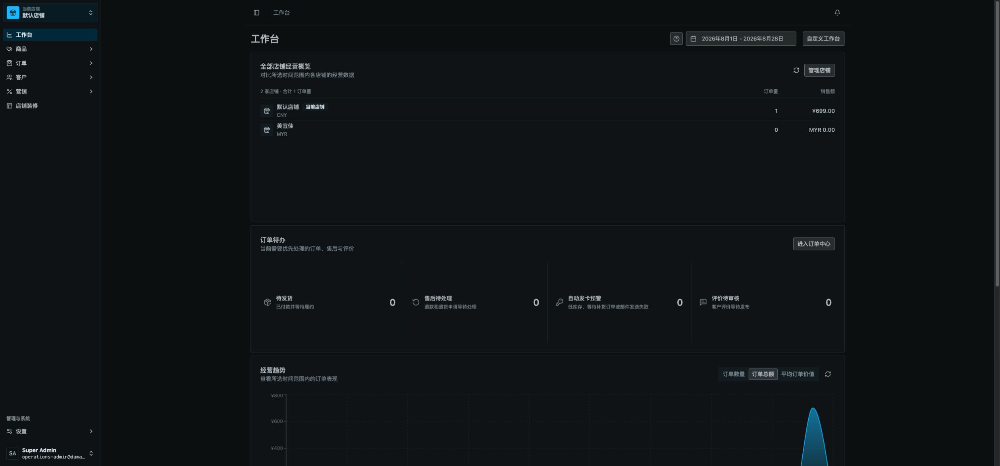

# Vendure 管理后台第二阶段深审计与整改规格

审计时间：2026-08-27（America/Los_Angeles）  
项目：Vendure 开源多店后台  
项目路径：`/Users/wangchao/Desktop/源码文件夹/vendure开源/vendure-master`  
技术栈：TypeScript、React 19、TanStack Query/Router、NestJS、GraphQL、TypeORM、Vendure  
包管理器：Bun  
当前分支：`release/workspace-consolidation-20260826`，本轮检查时相对 `origin/main` 落后 13 个提交

> 本文是第一阶段《ADMIN_AUDIT_REPORT.md》的深化与可实施整改规格。当前工作区存在大量用户未提交修改；本轮只增加审计文档和只读截图，没有修改业务代码、数据库结构、依赖、构建配置或生产数据，也没有 commit、push、部署。

## 一、深化结论

第一阶段的 **C+** 结论维持不变，但第二阶段把风险进一步收敛到六条可验证的技术链路：

1. **首屏被全部扩展阻塞。** Dashboard 必须等待国际化与全部扩展加载后才挂载应用；扩展入口又按顺序 `await import()`，低频后台模块也进入启动关键路径。
2. **生产初始脚本负担比单主包更大。** 本轮稳定工作台共观察到 47 个 script，其中 46 个来自后台自身域名；46 个脚本压缩传输合计约 **1,021,655 B（约 998 KB）**，主脚本单文件约 **818 KB gzip**。
3. **多人编辑仍以静默后写覆盖为主。** 普通内容和配置没有 `version`/`expectedUpdatedAt`；事务只保证一次提交内部原子，不能识别用户基于旧版本保存。
4. **自动发卡“手动重试”存在明确竞态窗口。** resolver 没有 `@Transaction()`，服务内却尝试悲观锁库存；同时重试没有幂等键或条件状态更新，两名管理员可能重复入队同一封卡密邮件。
5. **只读权限的页面操作体验不完整。** 后端写 mutation 有独立 Update 权限，这是安全优点；但多个页面只按 Read 权限显示菜单，同时仍展示保存、发布、刷新汇率等写按钮，只读用户要提交后才知道无权操作。
6. **慢查询风险集中在返利实时报表、余额核对和多店工作台。** 今日指标把当日订单/支付/退款加载到 Node 计算；余额核对聚合流水；多店工作台每个 Channel 单独发起查询，并每 60 秒重复。

## 二、关键流程逐步检查

### 1. 打开后台与身份恢复 — 严重



- `packages/dashboard/src/app/main.tsx:140-162` 在 `i18nLoaded` 和 `extensionsLoaded` 任一未完成时只显示全屏 `BootSplash`。
- 没有应用壳、导航骨架、当前加载阶段、超时提示或重试按钮；慢网下用户无法分辨是后台初始化、扩展加载还是接口卡住。
- 第一阶段冷访问一次约 16 秒才稳定；该单次值只能证明长尾存在，不能替代持续 RUM 指标。

### 2. 扩展注册与路由进入 — 严重

- `useDashboardExtensions()` 在应用首屏前运行全部扩展。
- `vite-plugin-dashboard-metadata.ts:65-72` 为每个扩展生成顺序 `await import()`。
- 当前至少有 6 个自定义 Dashboard 入口；每个插件入口静态导入其所有页面。`store-management`、`storefront-content`、`operations-dashboard` 等低频页面因此被提前解析。
- 生产工作台观察到 46 个后台脚本、约 998 KB gzip 初始脚本传输，说明仅拆成多个文件并没有形成有效的路由级按需加载。

### 3. 查询、刷新与慢网恢复 — 需要整改

- 优点：TanStack Query 全局使用 `keepPreviousData`，列表刷新和分页时不会整表闪白。
- 问题：通用 GraphQL `fetch` 没有统一 AbortSignal、超时、离线分类、请求 ID 或写操作幂等键。
- 全局关闭 `refetchOnWindowFocus`；长期开屏页面可能继续显示同事修改前的数据。
- 建议按页面风险分级：普通字典页可低频刷新，订单/库存/装修/配置需要最后更新时间、过期标识和聚焦刷新。

### 4. 自定义表单与草稿 — 需要整改

- 核心商品详情使用统一 form，具备 dirty、离开确认和快捷保存，属于可复用的正确模式。
- 静态扫描发现 18 个使用本地 `draft`/`drafts` 的自定义页面没有向 `Page` 传 form，也没有统一 `NavigationConfirmation`/router blocker；其中部分是弹窗草稿，不能一概视为整页丢失，但说明自定义编辑器没有统一接入保护体系。
- 币种、认证视觉、客户端插件、前台营销、返利、商务设置、导航、店铺资料、自动发卡等页面存在“查询数据变化后直接重置草稿”的写法。dirty 状态下 refetch 或缓存失效可能覆盖本地输入。

### 5. 权限入口与写操作 — 需要整改

- 后端 resolver 普遍使用 `@Allow(Read...)` 和 `@Allow(Update...)` 分开保护，未发现因此产生的服务端越权。
- 自定义 `DashboardRouteDefinition` 没有路由级 permission 字段，扩展路由注册也不在渲染前做权限判断；`requiresPermission` 仅作用于导航项，直接 URL 仍能进入页面外壳。
- 例：币种页导航要求 `ReadStoreProfile`，页面直接显示“保存配置”和刷新汇率；后端 mutation 要求 `UpdateStoreProfile`。店铺资料、商务设置、前台营销、店铺装修也有同类模式。
- 影响：只读人员能修改表单并等待提交，最终才收到 Forbidden；这会被用户理解为按钮失效、提交慢或系统不稳定。

### 6. 多人同时编辑 — 严重

- `VendureEntity` 提供 `updatedAt`，但没有通用 `VersionColumn`；商品、装修区块/设置、币种、店铺资料、商务设置、返利设置等更新输入没有携带预期版本。
- 典型场景：A 与 B 同时打开同一记录；A 先保存，B 基于旧快照保存不同字段。服务端无法知道 B 的基线已过期，后写可能覆盖 A。
- 装修编辑还提交完整 translations/items 数组，覆盖粒度大于用户实际修改字段，冲突损失更明显。
- 正向样例：售后状态迁移按 `{ id, channelId, state: oldState }` 条件更新并检查 `affected`；评论审核也只允许从 `PENDING` 条件更新。这种 CAS 模式应推广到其它高风险更新。

### 7. 自动发卡手动重试 — 严重

- `auto-card.resolver.ts:91-95` 的 `retryAutoCardDelivery` 缺少 `@Transaction()`。
- `retryDelivery()` 可能进入 `allocateExistingDelivery()`；后者在库存查询中使用 `pessimistic_write`。没有明确活动事务时，这个锁不能形成可靠的事务边界，具体表现还取决于数据库驱动。
- 重试随后无条件增加 `MANUAL_RETRY` 事件并调用 `dispatch()`；没有 `requestKey`、CAS 或“已在队列”约束。两个后台用户可同时把相同卡密邮件重复入队。
- 已有优点：库存项最终采用 `state = AVAILABLE` 的条件更新并检查 `affected`，订单行 delivery 还有唯一索引，因此库存重复分配已有较强防线；最明确的问题是**重复重发/重复事件**。

### 8. 报表、列表与数据库 — 需要整改

- 返利 `todayMetrics()` 加载当日全部已结算订单及支付、退款到 Node 再计算净额，随后还查历史买家并并发执行 4 个统计查询；页面每 60 秒轮询。
- 邀请关系按 `(channelId, boundAt)`、`(channelId, firstPaidOrderAt)` 统计，但现有主索引包含中间的 inviter 字段，不能完整覆盖这些日期范围查询。
- 自动发卡和售后列表在分页 `findAndCount` 中同时加载多个一对多关系，关系采用 join 时可能出现行放大和昂贵 count；应通过实际 SQL 日志确认。
- 多店工作台按 Channel `Promise.all` 查询，并每 60 秒重复；管理员和店铺数增长后，请求数按 `管理员数 × Channel 数` 线性增长。

## 三、统一并发控制规格

### API 契约

优先采用 `expectedUpdatedAt: DateTime!`，避免一次性给所有实体增加数据库版本列；对于高频状态机实体，可继续采用“预期旧状态 + 条件更新”。

```graphql
input UpdateStorefrontContentBlockInput {
  id: ID!
  expectedUpdatedAt: DateTime!
  # 现有可编辑字段
}
```

服务端必须执行条件更新或在同一事务中加锁后比较版本：

```text
UPDATE entity
SET ..., updatedAt = now()
WHERE id = :id AND channelId = :channelId AND updatedAt = :expectedUpdatedAt
```

`affected !== 1` 时返回统一错误：

```json
{
  "code": "CONCURRENT_MODIFICATION",
  "entityId": "...",
  "latestUpdatedAt": "...",
  "latestUpdatedBy": "..."
}
```

### 前端冲突处理

1. 保存时携带页面加载到的版本令牌。
2. 冲突后保留本地草稿，不自动覆盖。
3. 弹窗显示“服务器最新值 / 我的修改”，提供“重新载入”“复制我的内容”“逐字段合并”。
4. 禁止默认提供“强制覆盖”；只有明确拥有高级权限时才开放，并写入审计日志。
5. 成功保存后更新本地版本和“最后保存时间/保存人”。

### 第一批目标

- Product、Collection 的高频业务字段。
- StorefrontContentBlock、StorefrontContentSettings。
- StoreProfile、StoreCommerceConfiguration、StoreCurrencyConfiguration。
- ReferralProgramConfig、StorefrontPromotionDraft。
- 图像生成配置等会影响计费、供应商或全店行为的设置。

## 四、原子操作规格

以下组合动作应从前端多次 mutation 改为一个服务端命令，并在一个事务内完成：

| 新命令 | 当前风险 | 原子边界 |
| --- | --- | --- |
| `setHomepageModuleEnabled(type, enabled, expectedVersion)` | 并行更新多个区块，部分成功 | 更新全部相关区块或整体回滚 |
| `applyHomepageLayout(layout, expectedVersion)` | 创建缺失模块后排序失败 | 初始化、排序、版本校验整体提交 |
| `createAndAttachProductOptionGroup(productId, input, expectedVersion)` | 创建成功、绑定失败留下孤儿 | 创建、绑定、产品版本更新整体提交 |
| `removeProductOptionGroups(productId, ids, expectedVersion)` | 循环删除中途失败 | 校验后批量删除或整体回滚 |
| `retryAutoCardDelivery(id, requestKey)` | 两管理员重复发信 | 锁 delivery、判定可重试、记录唯一 action、入 outbox 整体提交 |

外部邮件、支付、翻译和图像供应商不能与数据库形成真正的跨系统事务，应采用 **事务内 outbox + 幂等消费者 + 可重放状态机**，而不是把网络调用长期包在数据库事务内。

## 五、性能整改规格

### 1. 启动与拆包

- 应用壳和权限/会话恢复优先渲染；国际化与非当前路由扩展不得阻塞导航骨架。
- 扩展入口只注册轻量 manifest，页面组件使用 route-level lazy import。
- 当前路由扩展可以并行预加载；低频报表、图像、营销、装修等在进入路由或浏览器空闲时再加载。
- 将生产构建预算作用于“初始路由总 gzip”，不能只检查单 chunk。
- 建议首期预算：初始 JS 总 gzip ≤ 400 KB、单个低频路由 chunk ≤ 200 KB；最终预算以真实设备 RUM 的 LCP/INP 和缓存命中率校准。

### 2. 返利与多店报表

- 按当前 tab 拆分 GraphQL query，隐藏 tab 不预取重型列表。
- `balanceAudit` 改为手动触发的后台 job，保存进度、完成时间和结果快照；默认页面只读取最近一次结果。
- 今日指标改为 SQL 聚合或按分钟/日期维护快照，不把全量订单/支付/退款实体加载到 Node。
- 工作台增加一个后端聚合查询，在服务端按当前操作者可访问 Channel 返回各店摘要；避免每个浏览器每分钟发 N 次请求。

### 3. 候选索引（必须先 EXPLAIN）

以下是源码查询形态推导出的候选项，不应直接上生产。新增迁移、修改数据库结构前必须获得用户确认，并先对生产同形 SQL 执行 `EXPLAIN (ANALYZE, BUFFERS)`：

| 表/实体 | 候选索引 | 对应场景 |
| --- | --- | --- |
| Payment | `(state, updatedAt, orderId)` | 今日已结算支付时间窗口 |
| ReferralRelationship | `(channelId, boundAt)` | 当日绑定数 |
| ReferralRelationship | `(channelId, firstPaidOrderAt)` | 当日受邀购买人数 |
| ReferralReward | `(channelId, earnedAt)` | 管理列表按店铺和时间 |
| ReferralLedgerEntry | `(channelId, walletId)` | 余额审计按钱包聚合 |
| ReferralWithdrawal | `(channelId, createdAt)` | 不限状态的最新提现列表 |
| AutoCardDelivery | `(channelId, orderId)` | 按店铺和订单查发卡记录 |
| AfterSalesRequest | `(channelId, createdAt)` | 不限状态的最新售后列表 |

## 六、权限与操作反馈规格

- 扩展路由增加真正的 `requiresPermission`，在 route `beforeLoad` 阶段拒绝直接 URL，并渲染统一 403 页面。
- 页面使用 action-level 权限判断：没有 Update 权限时，字段只读；保存、发布、刷新、同步、删除按钮不展示或明确禁用并解释原因。
- 后端 `@Allow` 保持最终安全边界，前端权限只负责正确体验，不能替代服务端授权。
- 写请求超过 400 ms 显示行级 pending；超过 2 s 显示持续反馈；超时后必须告诉用户“是否已提交未知”，并提供按 request ID 查询结果，避免盲目重试。
- 查询支持 AbortSignal；写请求只有携带幂等键时才允许自动重试。

## 七、可直接拆分的整改工单

| 优先级 | 工单 | 主要范围 | 验收条件 | 规模 |
| --- | --- | --- | --- | --- |
| P1 | 后台启动关键路径拆分 | dashboard `main.tsx`、扩展 metadata、6 个扩展入口 | 应用壳先渲染；低频路由不在首屏加载；初始总 gzip 达预算 | L |
| P1 | 通用乐观并发协议 | GraphQL 输入、服务层、Dashboard 表单 | 双用户第二次旧版本保存返回冲突，不静默覆盖 | L |
| P1 | 自动发卡重试原子化和幂等 | auto-card resolver/service/entity/outbox | 同一 delivery 两次并发重试只产生一次有效入队和一次动作记录 | M |
| P1 | 装修与商品组合 mutation | storefront-content、商品规格操作 | 注入任一步异常时全部回滚 | L |
| P1 | 返利报表拆分与余额审计后台化 | referral GraphQL/service/dashboard | 默认 tab 不执行隐藏报表；余额审计异步可追踪 | L |
| P2 | 自定义表单 dirty/离开保护 | 18 个候选页面逐个确认 | 未改不可保存；dirty 时刷新结果不覆盖；离开有提示 | M |
| P2 | 路由/动作权限统一 | extension route API、各自定义页面 | 只读账号看不到可写控件；直接 URL 得到统一 403 | M |
| P2 | GraphQL 超时、取消、幂等与错误分类 | dashboard GraphQL client、mutation hooks | 查询可取消；超时/离线/403/冲突可区分；写重试有幂等保护 | M |
| P2 | 多店工作台聚合 API | operations dashboard + core/plugin service | 每次刷新固定 1 个请求，不随 Channel 数线性增长 | M |
| P2 | SQL 与索引验证 | referral、auto-card、after-sales、payment | 有真实 EXPLAIN 前后对比；无回归；迁移经明确批准 | M |
| P2 | 生产观测与构建门禁 | bundle、i18n、APM/RUM、CI | 初始总包预算、编译 catalog、GraphQL p95、慢查询进入门禁/看板 | M |

## 八、并发与故障注入测试矩阵

| 场景 | 操作 | 必须结果 |
| --- | --- | --- |
| 同一商品双人编辑 | A 保存后 B 用旧版本保存 | B 收到冲突；A 数据不丢；B 草稿保留 |
| 同一装修区块双人编辑 | A 改标题、B 改图片 | 不允许完整数组静默覆盖；可比较并合并 |
| 首页布局组合操作 | 在创建第 2 个模块后注入异常 | 所有创建和排序回滚 |
| 规格组创建并绑定 | 在绑定阶段注入异常 | 不留下孤儿规格组 |
| 自动发卡双人重试 | 两请求同毫秒进入 | 只产生一次有效 outbox/邮件；重复请求返回同一结果 |
| 自动发卡库存竞争 | 两订单争抢最后一张卡 | 仅一个条件更新成功；另一单进入 WAITING_STOCK/MANUAL_REVIEW |
| 售后双人审核 | 两人基于 PENDING 提交不同状态 | 仅一个 CAS 成功；另一人收到状态已变化 |
| 慢网保存 | 服务端成功、响应在客户端超时 | 通过 request key 查询到已提交结果，不重复执行 |
| 只读角色直达 URL | 访问币种/装修并尝试写 | 页面只读或 403；不展示可写按钮；后端继续拒绝 |
| 返利大数据量 | 订单/流水按预期峰值构造 | GraphQL p95 达标；无全量实体加载；审计异步完成 |

## 九、建议实施顺序

1. **止损并发风险：** 自动发卡重试幂等、普通编辑冲突协议、组合 mutation。
2. **解除启动阻塞：** 应用壳、扩展 manifest、路由懒加载、初始总包门禁。
3. **降低数据库压力：** 返利按 tab 加载、余额审计后台化、多店聚合、SQL EXPLAIN。
4. **统一专业体验：** dirty/离开保护、只读权限呈现、最后更新时间、错误分类。
5. **形成持续门禁：** 双用户并发测试、失败注入、RUM/APM、bundle 与 i18n 检查。

## 十、本轮检查与限制

### 已完成

- 生产工作台当前会话只读截图和初始资源清点。
- Dashboard 启动门、扩展加载、路由权限、通用 GraphQL 请求层源码审计。
- 店铺资料、商务设置、币种、前台营销、装修页面的 Read/Update 权限对照。
- 自动发卡、售后、评论审核的事务、锁、CAS 和幂等边界审计。
- 返利今日指标、余额审计、实体索引和多店工作台查询形态审计。

### 定向命令结果

- `bun run check-types`（commerce-fulfillment、operations-dashboard、image-generation）：失败。首要原因是工作区无法解析尚未生成的 `@vendure/core`/`@vendure/common` 包入口，继发大量类型错误；不是本轮审计文档造成。
- commerce fulfillment 自动发卡/售后定向测试：测试收集前失败，原因同为 `@vendure/core` 入口不可解析，0 个测试实际执行。
- storefront review CAS 定向测试：测试收集前失败，原因同上，0 个测试实际执行。
- dashboard extension hook 测试：Vite 配置加载阶段失败，原因同为 `@vendure/core` 入口不可解析。
- 第一阶段已通过的检查仍记录在 `ADMIN_AUDIT_REPORT.md`：dashboard、store-management、storefront-content typecheck 通过；相关定向测试共 64 项通过；i18n 总检查有 10 项问题。

### 尚需生产证据

- 没有生产数据库只读凭据、SQL 日志或 APM，索引项仍是候选，不能宣称已经定位到真实最慢 SQL。
- 没有用两个生产账号执行真实并发写操作；冲突结论来自输入契约、条件更新、事务边界和前端编排的代码证据。
- 没有执行支付、退款、提现、发货、汇率采集、自动发卡重试等生产写操作。
- 没有修改数据库 migration；如进入索引或版本字段实施，必须先单独确认。

